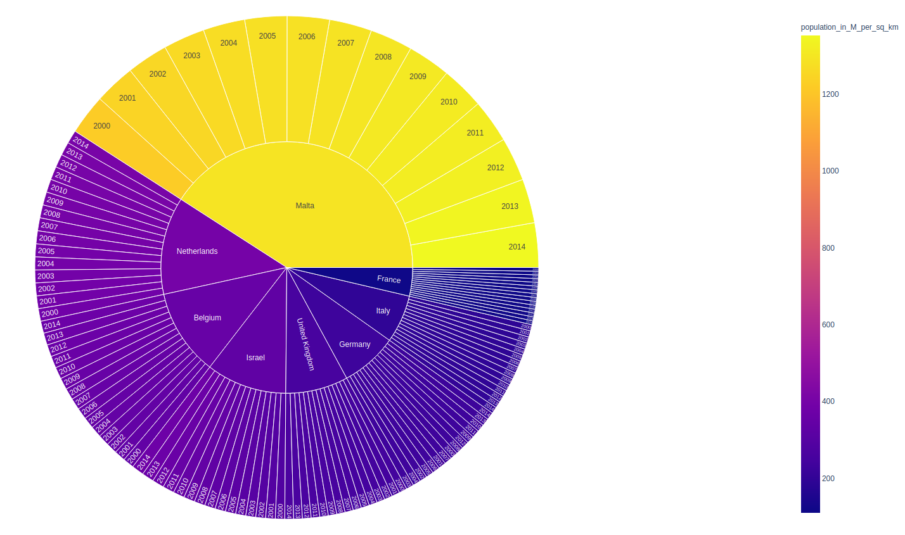

# Data-Visualisation
This repository is a compilation of Assignments that I have attempted for my Data Visualisation course.

## Datathon 1
We are given the data of India Ocean, generated by the ocean model MOM, run by Indian National Center for Ocean Information Services, INCOIS, Hyderabad. The data values are 5-day moving average of the following variables:
1) Sea Surface Salinity (SSS)
2) Sea Surface Temperature (SST)
3) Sea Surface Height Anomaly (SSHA)
4) Meridional current
5) Zonal current
Our main aim is to effectively visualize the above data to find interesting underlying patterns of the Indian Ocean. We would like to study the effect spatial and temporal patterns of Indian Ocean has on the monsoons of India. Since we have the data around the time of the Tsunami of December 2004, we will also look at the visualizations to infer the impact of the tsunami on the above mentioned variables.

### Visualizations

## Datathon 2
We are given the data of India Ocean, generated by the ocean model MOM, run by Indian National Center for Ocean Information Services, INCOIS, Hyderabad. The data
values are available for the following variables at different depths ranging from 5m to 225m with an interval of 10m:
1) Salinity – It is the amount of salt dissolved in a body of water.
2) Potential Temperature – The temperature that an unsaturated parcel of dry air would have if brought adiabatically and reversibly from its initial state to a standard pressure.
3) Meridional current – Meridional currents flows from north to south, or from south to north, along the Earth’s longitude lines (or meridian circles)
4) Zonal current – Zonal currents flows from east to west, or from west to east, along the Earth’s latitude lines

### Visualizations

## Datathon 3
We are given the tabular datasets published by the World Health Organization for COVID-19 cases. These include State/Country/Reign-wise time series data (over a period of 246 days starting from January 2020) for confirmed cases, recovered cases and deaths. Our main aim is to effectively visualize the above data as a network to find underlying patterns or communities formed.

### Visualizations

## Datathon 4
We have used the same data as provided in Datathon 3. Our main aim is to effectively visualize the above data as a matrix and find the underlying patterns or clusters formed using two different methods of matrix seriation which are – Fast optimal leaf ordering and Seriation using Traveling Salesperson Problem formulation. These methods are implemented in the Datathon 4 folder.

### Visualizations

## Datathon 5
We are given a tabular dataset published by United Nations Economic Commission for Europe (UNECE) which has the Country Overview data. It consists data for 52
distinct countries from 2000 to 2016. It has 79 columns that ranges over different characteristics of measuring performance of the nations. I will be using a subset of this dataset to test some of my hypotheses and will make inferences from the same.

### Visualizations

